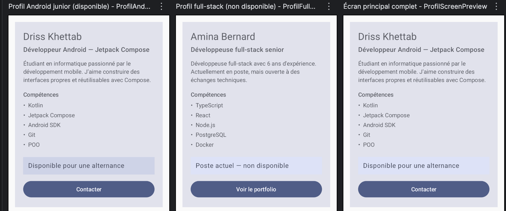

# Profil développeur Compose

Fiche « Profil développeur » réalisée avec **Jetpack Compose** (Kotlin), dans le cadre du devoir noté du module *Développement Android avec Jetpack Compose*.

## Description courte

Cette application affiche un **écran unique** présentant la fiche d'un développeur : son **nom**, son **rôle**, une courte **description**, la **liste de ses compétences**, son **information de disponibilité** et deux **actions utilisateur** (un badge de disponibilité cliquable et un bouton « Contacter »).
L'écran est entièrement découpé en **petits composables réutilisables**, chacun recevant ses données en paramètres et acceptant un `Modifier`, afin que le parent décide du placement. Aucune donnée n'est figée : les mêmes composants affichent plusieurs profils différents (voir les previews).

## Notions Compose utilisées

- **Composables** (`@Composable`) et découpage en composants
- **Paramètres** de composables (nom, rôle, description, compétences, textes, callbacks)
- **Modifiers** et **chaînage de modifiers** (`fillMaxWidth`, `padding`, `clickable`, `semantics`)
- **Padding externe / padding interne** (distinction claire, voir plus bas)
- **Callbacks** `() -> Unit` pour signaler les événements utilisateur
- **Surface**, **Column**, **Text**, **Button**
- **Scaffold** + `innerPadding` et **`setContent`** dans `MainActivity`
- **Accessibilité de base** : `Role.Button` + `contentDescription`
- **Previews** (`@Preview`) montrant deux variantes de profil
- **Thème** généré du projet (`ProfilDeveloppeurTheme`, Material 3)

> Aucune notion hors périmètre n'est utilisée : pas de `remember`, `mutableStateOf`, `LazyColumn`/`LazyRow`, ViewModel, navigation, API, persistance, etc. Le clic appelle simplement un callback vide.

## Explication courte (réponses aux questions)

**1. Quels composables avez-vous créés ?**
`ProfilScreen` (écran principal), `ProfilCard` (la fiche), `ProfilHeader` (en-tête nom + rôle), `ProfilDescription`, `SectionTitle`, `SkillItem` (une compétence), `AvailabilityBadge` (zone de disponibilité cliquable) et `ContactButton` (action). Soit **8 composables**, dont **7 reçoivent des paramètres** (largement au-dessus des 5 composables et 4 paramétrés demandés).

**2. Quel composable représente l'écran principal ?**
`ProfilScreen`. C'est lui qui décide **quelles données** afficher et **comment la fiche se place** dans l'écran. Il est appelé depuis `MainActivity` via `setContent { ProfilDeveloppeurTheme { Scaffold { ... ProfilScreen(...) } } }`.

**3. Où utilisez-vous un padding externe ?**
Dans `ProfilScreen`, sur la chaîne `modifier.fillMaxWidth().padding(16.dp)` : ce `padding(16.dp)` éloigne **la carte des bords de l'écran**. C'est le **parent** qui décide de l'espace *autour* du composant. De même, l'`innerPadding` du `Scaffold` appliqué dans `MainActivity` est un padding externe. Enfin, chaque sous-composant reçoit du parent un `Modifier.padding(bottom = …)` pour l'espacement *entre* les éléments.

**4. Où utilisez-vous un padding interne ?**
Dans `ProfilCard`, la `Column` applique `Modifier.padding(20.dp)` : cela éloigne **le contenu des bords de la carte**. C'est le **composant** qui décide de son espace *interne*. Le badge de disponibilité applique aussi un `padding(12.dp)` interne autour de son texte.

> **Règle retenue :** le *parent* contrôle l'espace **autour** (padding externe), le *composant* contrôle son espace **à l'intérieur** (padding interne).

**5. Quel composant reçoit un callback ?**
Deux composants : `ContactButton` reçoit `onClick: () -> Unit` (bouton « Contacter » / « Voir le portfolio ») et `AvailabilityBadge` reçoit `onClick: () -> Unit`. Ces callbacks remontent jusqu'à `ProfilScreen`, où ils sont pour l'instant **vides** (un commentaire). Le composant **signale** l'événement, il ne décide pas de la logique applicative.

**6. Quelle information d'accessibilité avez-vous ajoutée ?**
Sur la **zone personnalisée cliquable** `AvailabilityBadge` (une `Surface`, pas un vrai bouton), j'ai ajouté :
- `clickable(role = Role.Button, …)` → l'élément est **annoncé comme un bouton** ;
- `semantics { contentDescription = "$text. Appuyez pour en savoir plus." }` → une **description claire** de l'action pour un lecteur d'écran (TalkBack).
Le composant `ContactButton` utilise un vrai `Button` : celui-ci est **déjà explicite** pour l'accessibilité (il expose nativement son rôle de bouton et son libellé via le `Text` interne), il n'a donc pas besoin d'un `Role.Button` ajouté à la main — contrairement à la `Surface` cliquable.

**7. Pourquoi vos composants peuvent-ils être considérés comme réutilisables ?**
Parce qu'ils :
- reçoivent leurs **données en paramètres** (aucune valeur codée en dur), donc un même composable affiche plusieurs profils ;
- acceptent tous un `modifier: Modifier = Modifier` **utilisé** en interne, donc le **parent décide** du placement externe ;
- ne contiennent **aucune logique métier** : ils exposent des **callbacks** et laissent le parent décider.
Les **deux previews** le démontrent : les mêmes composants affichent un profil Android junior *disponible* et un profil full-stack *non disponible*, avec des compétences différentes.

## Chaîne de modifiers (exemple significatif)

Dans `AvailabilityBadge`, la chaîne a un sens précis :

```kotlin
modifier
    .clickable(role = Role.Button, onClick = onClick) // comportement : réagit au clic
    .semantics { contentDescription = "…" }           // accessibilité : action compréhensible
```

et côté parent, le placement :

```kotlin
Modifier
    .fillMaxWidth()          // occupe toute la largeur
    .padding(16.dp)          // padding EXTERNE : marge avec les bords de l'écran
```

L'**ordre** compte : on prend d'abord toute la largeur, **puis** on garde une marge.

## Previews

Le fichier `MainActivity.kt` contient **trois** `@Preview` :

1. `ProfilAndroidJuniorPreview` — profil Android junior **disponible** ;
2. `ProfilFullStackPreview` — profil full-stack **non disponible**, compétences différentes ;
3. `ProfilScreenPreview` — l'écran principal complet.

## Capture d'écran



> *Rendu des deux variantes de la fiche.* Pour la version finale, vous pouvez remplacer cette image par une **capture directe** du volet **Preview** d'Android Studio (clic droit sur la preview → *Copy Image*) ou par une **capture de l'émulateur**.

## Lancer le projet

1. Ouvrir le dossier `ProfilDeveloppeurCompose/` dans **Android Studio**.
2. Laisser Gradle se synchroniser.
3. Ouvrir `app/src/main/java/com/example/profildeveloppeur/MainActivity.kt`.
4. Afficher le volet **Split / Design** pour voir les previews, ou lancer l'app sur un émulateur/appareil.

- **Langage :** Kotlin · **UI :** Jetpack Compose (Material 3)
- **minSdk :** 24 · **targetSdk / compileSdk :** 36 · **package :** `com.example.profildeveloppeur`

## Dépôt Git

Dépôt public : **https://github.com/Driss-Khettab/Android-Compose-01**
